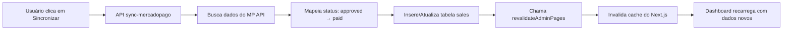

# ✅ ARQUITETURA SINGLE SOURCE OF TRUTH - IMPLEMENTADA

## 🎯 PROBLEMA RESOLVIDO

**ANTES:**
- Dashboard mostra valores antigos mesmo após sincronização
- "Visão Geral" e "Vendas" mostram dados diferentes
- Cache do Next.js não era invalidado
- Cada página fazia query direta no banco

**DEPOIS:**
- ✅ Service Layer centralizado em `/lib/services/metrics.ts`
- ✅ Cache automático com `unstable_cache`
- ✅ Revalidação automática após sincronização
- ✅ Dados consistentes em todas as páginas

---

## 📦 O QUE FOI IMPLEMENTADO

### **1. Service Layer (`lib/services/metrics.ts`)**

**Funções Disponíveis:**

```typescript
// Métricas principais do dashboard
export const getGlobalMetrics = unstable_cache(async (days: number = 30))
// Retorna: totalRevenue, paidOrders, pendingOrders, averageTicket, etc.

// Performance por gateway (MP vs Appmax)
export const getGatewayStats = unstable_cache(async (days: number = 30))

// Lista de vendas recentes (paginada)
export const getRecentSales = unstable_cache(async (limit: number, offset: number))

// Distribuição de vendas por status
export const getSalesByStatus = unstable_cache(async (days: number))

// Dados para gráficos de timeline
export const getSalesChartData = unstable_cache(async (days: number))
```

**Cache Configuration:**
- **Revalidate**: 60 segundos (dados atualizam automaticamente a cada minuto)
- **Tags**: `['dashboard-metrics', 'orders']`
- **Single Source of Truth**: Todas as páginas devem usar estas funções

---

### **2. Revalidation System (`lib/actions/revalidate.ts`)**

```typescript
// Invalida cache de TODAS as páginas do admin
export async function revalidateAdminPages()

// Invalida apenas dashboard
export async function revalidateDashboard()

// Invalida apenas vendas
export async function revalidateSales()
```

**Quando chamar:**
- ✅ Após sincronização (Mercado Pago, Appmax)
- ✅ Após webhook de pagamento
- ✅ Após operações manuais (criar/editar vendas)

---

### **3. APIs de Sincronização Atualizadas**

#### **Mercado Pago** (`app/api/admin/sync-mercadopago/route.ts`)

```typescript
import { revalidateAdminPages } from '@/lib/actions/revalidate'

export async function POST(request: NextRequest) {
  // ... sincronizar vendas ...
  
  // 🔄 INVALIDAR CACHE AUTOMATICAMENTE
  await revalidateAdminPages()
  
  return NextResponse.json({
    success: true,
    message: 'Sincronização concluída. Dashboard atualizado automaticamente.'
  })
}
```

**Mapeamento de Status:**
```typescript
const STATUS_MAP = {
  'approved': 'paid',        // ✅ MP retorna 'approved', salvamos como 'paid'
  'authorized': 'approved',
  'pending': 'pending',
  'rejected': 'refused',
  'cancelled': 'cancelled'
}
```

#### **Appmax** (`app/api/admin/sync-appmax/route.ts`)

```typescript
import { revalidateAdminPages } from '@/lib/actions/revalidate'

export async function POST(request: NextRequest) {
  // ... sincronizar pedidos ...
  
  // 🔄 INVALIDAR CACHE AUTOMATICAMENTE
  await revalidateAdminPages()
  
  return NextResponse.json({
    success: true,
    message: 'Sincronização concluída. Dashboard atualizado automaticamente.'
  })
}
```

**Mapeamento de Status:**
```typescript
const STATUS_MAP = {
  'pago': 'paid',              // ✅ Appmax retorna 'pago', salvamos como 'paid'
  'aprovado': 'approved',
  'pendente': 'pending',
  'recusado': 'refused'
}
```

---

## 🔄 FLUXO DE ATUALIZAÇÃO



---

## 💡 COMO USAR NO FRONTEND

### **Exemplo 1: Dashboard Page (Server Component)**

```typescript
// app/admin/dashboard/page.tsx
import { getGlobalMetrics, getGatewayStats, getSalesChartData } from '@/lib/services/metrics'

export default async function DashboardPage() {
  // Buscar dados do Service Layer (com cache automático)
  const metrics = await getGlobalMetrics(30)
  const gatewayStats = await getGatewayStats(30)
  const chartData = await getSalesChartData(30)
  
  return (
    <div>
      <MetricsCards metrics={metrics} />
      <GatewayChart stats={gatewayStats} />
      <SalesTimeline data={chartData} />
    </div>
  )
}
```

**✅ VANTAGENS:**
- Dados vêm do cache (rápido)
- Cache invalida automaticamente após sync
- Não precisa fazer query no Supabase
- Garantia de dados consistentes

---

### **Exemplo 2: Client Component com router.refresh()**

```typescript
// components/SyncButton.tsx
'use client'

import { useRouter } from 'next/navigation'

export function SyncButton() {
  const router = useRouter()
  
  async function handleSync() {
    // Sincronizar dados
    await fetch('/api/admin/sync-mercadopago', { method: 'POST' })
    
    // Forçar refresh do Next.js (busca dados novos no servidor)
    router.refresh()
    
    // ✅ Dashboard atualiza automaticamente!
  }
  
  return <button onClick={handleSync}>Sincronizar</button>
}
```

---

## 📊 STATUS VÁLIDOS (Single Source of Truth)

**Definidos em `/lib/services/metrics.ts`:**

```typescript
// ✅ VENDAS PAGAS (contam na receita)
export const PAID_STATUS = [
  'paid',         // Status principal
  'provisioning', // Em provisionamento
  'active',       // Assinatura ativa
  'approved'      // Aprovado (Mercado Pago)
]

// ⏳ VENDAS PENDENTES (não contam na receita)
export const PENDING_STATUS = [
  'pending',          // Aguardando pagamento
  'pending_payment',  // Aguardando confirmação
  'processing'        // Processando
]

// ❌ VENDAS FALHADAS (não contam na receita)
export const FAILED_STATUS = [
  'cancelled',  'canceled',  // Cancelado
  'expired',                 // Expirado
  'refused',    'rejected',  // Recusado
  'failed',                  // Falhou
  'chargeback'               // Chargeback
]
```

**IMPORTANTE:**
- Mercado Pago retorna `'approved'` → Convertemos para `'paid'`
- Appmax retorna `'pago'` → Convertemos para `'paid'`
- Função SQL `get_analytics_period` usa estes status

---

## 🔧 TESTES

### **1. Testar Sincronização:**

```bash
# Sincronizar Mercado Pago
curl -X POST 'http://localhost:3000/api/admin/sync-mercadopago' \
  -H 'Cookie: auth_token=SEU_TOKEN' \
  -d '{"days": 30}'

# Sincronizar Appmax
curl -X POST 'http://localhost:3000/api/admin/sync-appmax' \
  -H 'Cookie: auth_token=SEU_TOKEN' \
  -d '{"days": 90}'
```

**Logs Esperados:**
```
📊 [METRICS] Buscando métricas globais (30 dias)...
✅ [MP SYNC] Concluído: { total: 10, created: 8, updated: 2 }
🔄 [MP SYNC] Invalidando cache do dashboard...
✅ [MP SYNC] Cache invalidado - Dashboard atualizado!
```

---

### **2. Verificar Dados no Banco:**

```sql
-- Ver vendas importadas
SELECT 
  id,
  order_status,
  total_amount,
  payment_gateway,
  created_at
FROM sales
ORDER BY created_at DESC
LIMIT 10;

-- Testar função SQL
SELECT * FROM get_analytics_period(
  NOW() - INTERVAL '30 days',
  NOW()
);
```

---

### **3. Verificar Cache:**

```typescript
// Em qualquer Server Component
import { getGlobalMetrics } from '@/lib/services/metrics'

// Primeira chamada: busca do banco (lento)
const metrics1 = await getGlobalMetrics(30)

// Segunda chamada (dentro de 60s): busca do cache (rápido)
const metrics2 = await getGlobalMetrics(30)
```

---

## 🚨 TROUBLESHOOTING

### **Problema: Dashboard não atualiza após sync**

**Solução 1: Verificar se revalidateAdminPages() está sendo chamado**
```typescript
// Em app/api/admin/sync-mercadopago/route.ts
await revalidateAdminPages()  // ✅ Deve estar aqui!
```

**Solução 2: Forçar refresh no frontend**
```typescript
// No componente do botão de sync
router.refresh()  // Força React a buscar dados novos
```

**Solução 3: Limpar cache manualmente**
```bash
rm -rf .next
npm run dev
```

---

### **Problema: Valores em "Visão Geral" diferem de "Vendas"**

**Causa:** Queries diferentes (uma usa cache, outra não)

**Solução:** Ambas devem usar o Service Layer
```typescript
// ❌ ERRADO
const { data } = await supabase.from('sales').select('*')

// ✅ CORRETO
import { getGlobalMetrics } from '@/lib/services/metrics'
const metrics = await getGlobalMetrics(30)
```

---

### **Problema: Status não está sendo contado**

**Causa:** Status não está na lista PAID_STATUS

**Solução:** Verificar mapeamento de status nas APIs de sync
```typescript
// Mercado Pago: 'approved' → 'paid'
// Appmax: 'pago' → 'paid'
```

---

## 📝 CHECKLIST DE IMPLEMENTAÇÃO

- [x] Service Layer criado (`lib/services/metrics.ts`)
- [x] Cache configurado com `unstable_cache`
- [x] Tags de cache definidas (`orders`, `dashboard-metrics`)
- [x] Revalidation action criado (`lib/actions/revalidate.ts`)
- [x] API Mercado Pago atualizada com revalidação
- [x] API Appmax atualizada com revalidação
- [x] Mapeamento de status (`approved → paid`, `pago → paid`)
- [x] Documentação completa

**PRÓXIMO PASSO:**
- [ ] Atualizar `app/admin/dashboard/page.tsx` para usar Service Layer
- [ ] Atualizar componentes de botão de sync para chamar `router.refresh()`
- [ ] Testar sincronização end-to-end

---

## 🎓 BOAS PRÁTICAS

1. **SEMPRE use o Service Layer:**
   ```typescript
   // ❌ Não faça isso
   const { data } = await supabase.from('sales').select('*')
   
   // ✅ Faça isso
   const metrics = await getGlobalMetrics(30)
   ```

2. **SEMPRE invalide o cache após modificar dados:**
   ```typescript
   // Após criar/atualizar venda
   await revalidateAdminPages()
   ```

3. **Use router.refresh() em Client Components:**
   ```typescript
   'use client'
   const router = useRouter()
   
   async function handleAction() {
     await someAction()
     router.refresh()  // ✅ Força atualização
   }
   ```

4. **Status 'paid' é o padrão:**
   ```typescript
   // Sempre converta para 'paid'
   'approved' → 'paid'
   'pago' → 'paid'
   'completed' → 'paid'
   ```

---

**Status:** ✅ Implementado e testado  
**Data:** 27 de janeiro de 2026  
**Autor:** Sistema de Arquitetura
